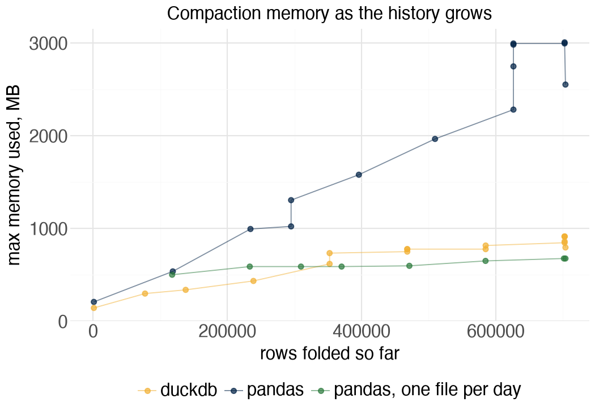
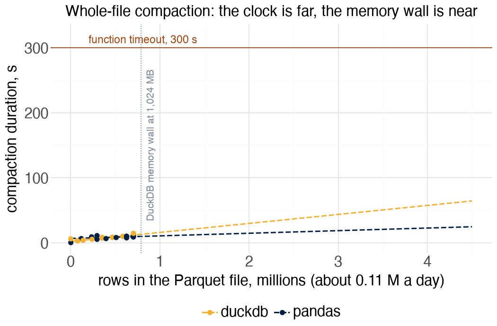
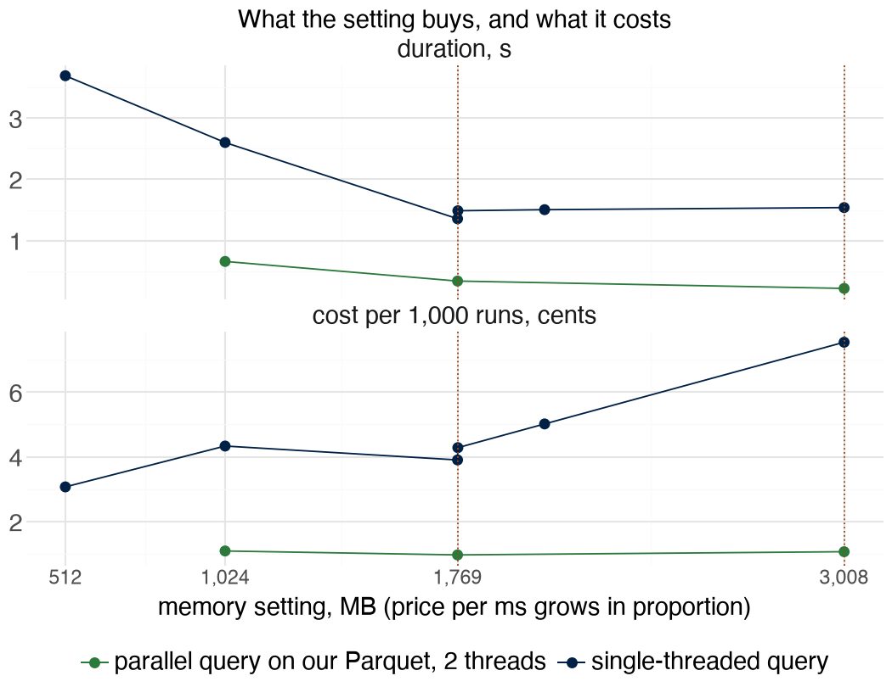

# Measurements

Measurements taken on the deploy night of the two pipelines and used in lecture L3 of CPSC 436C.

## Three things the measurements showed

**The layout fails before the engine does.** A compaction that rewrites the whole Parquet file every quarter hour
needs memory in proportion to the history, whichever engine does it. On the GDELT files the pandas version ran out
of memory on day three at 1,024 MB and again near day seven at 3,008 MB. The DuckDB version streams and spills, and
still climbs. The same pandas code writing one Parquet per day stays flat at 500 to 675 MB whatever the history holds.

**The clock is far, the memory wall is near.** Extrapolating the whole-file durations, the 300-second timeout
arrives near 21 million rows, about 200 days of GDELT. The memory setting runs out about a day away.

**Memory buys CPU, and the price follows.** Lambda allocates CPU in proportion to the memory setting, one vCPU at
1,769 MB, more than one core above that, and the price per millisecond grows in the same proportion. So the cost
of one run is memory times time. We ran two queries at settings from 512 MB to 3,008 MB, the ceiling on this
account, and priced each run from the price sheet.

Below the knee a single-threaded run costs about the same at any setting, because its time falls as the price
rises, so memory buys speed there for free. Above the knee every megabyte is paid for nothing, since one thread
cannot use a second core. A query DuckDB can split across the file's row groups keeps its cost per run above the
knee while running 1.5 times faster at 3,008 MB. The rule for raising the memory setting is therefore: raise it
when the code can spend the CPU, and the bill tells you within one run.

Two cautions that travel with the chart. The docs meter CPU as credits per second and run-to-run variance is
large, so these are medians of three runs. And DuckDB parallelises by row groups: a source without them, such as a
generated range, arrives as one stream and can never show a second core, which is how the first version of this
measurement went wrong.

## Sources the numbers rest on

AWS Lambda developer guide: configuring memory, troubleshooting configuration (CPU-bound configurations), Lambda
quotas. DuckDB documentation: performance guide, how to tune workloads (parallelism by row groups). Apache Parquet
documentation: file format, row groups and column chunks.
